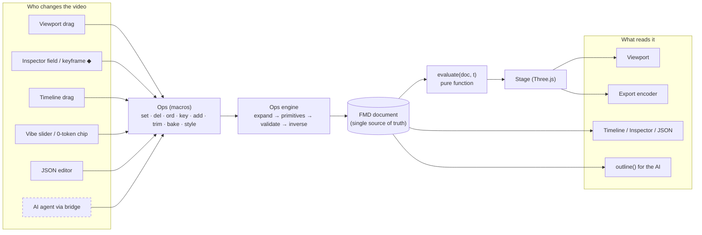
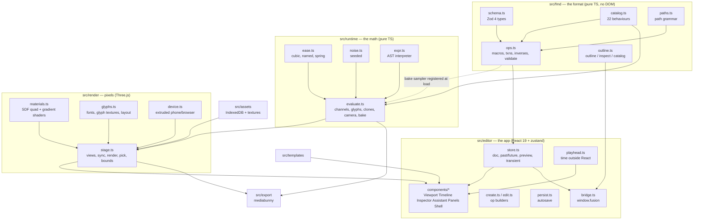
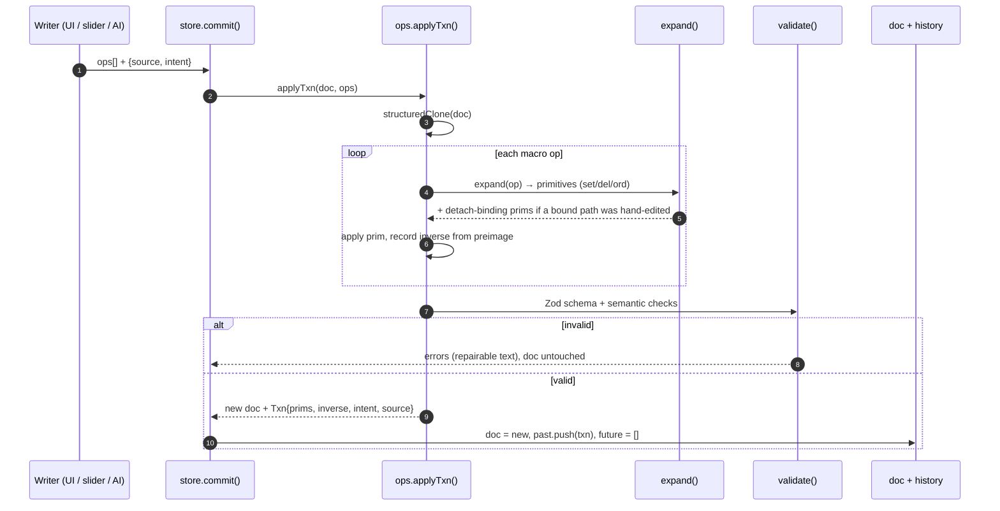
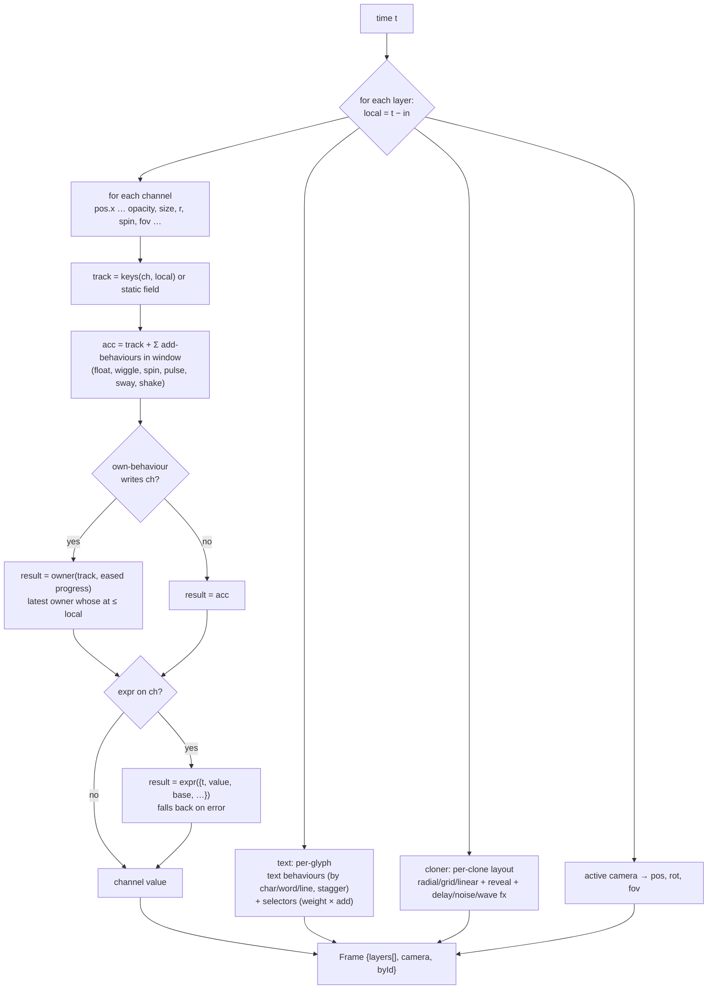
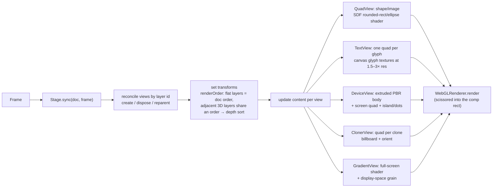
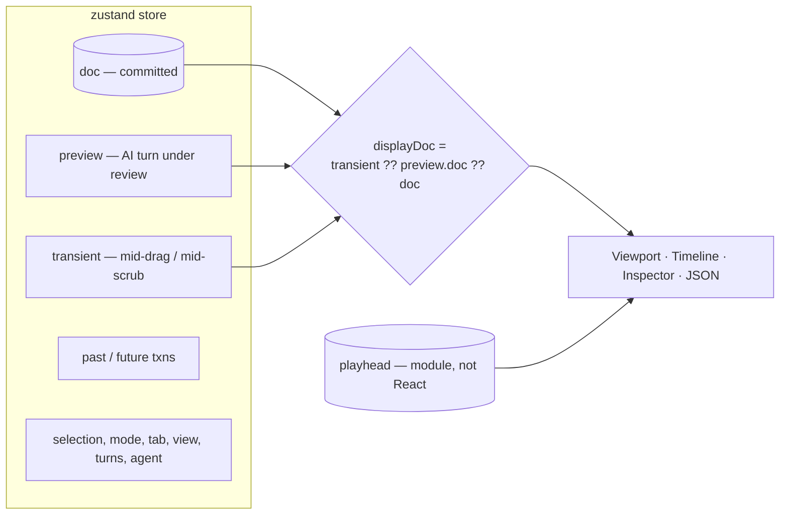
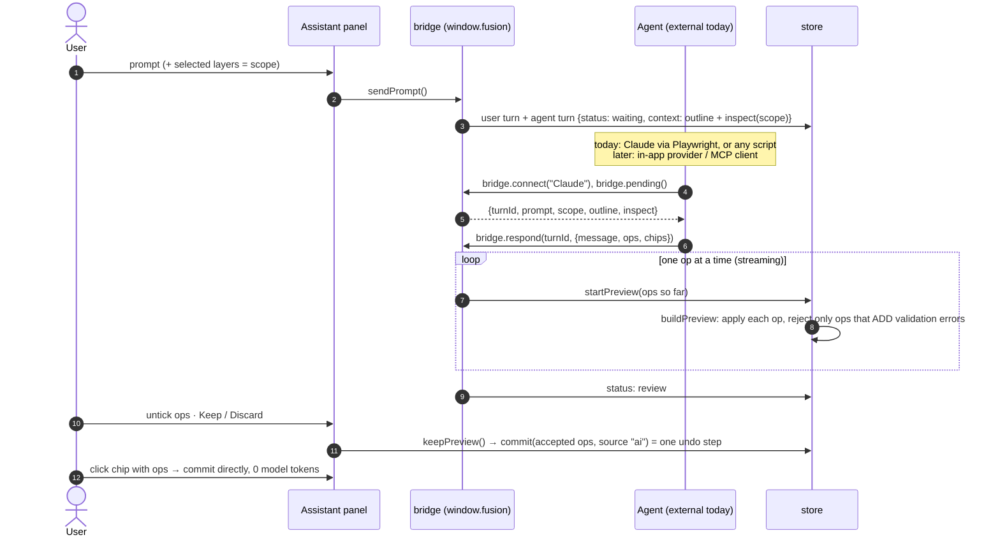
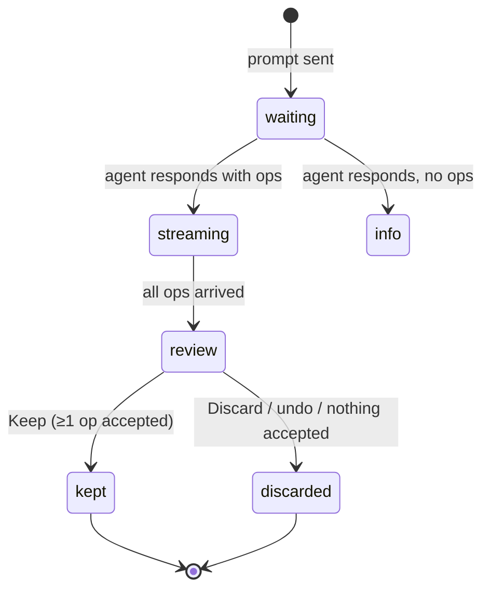
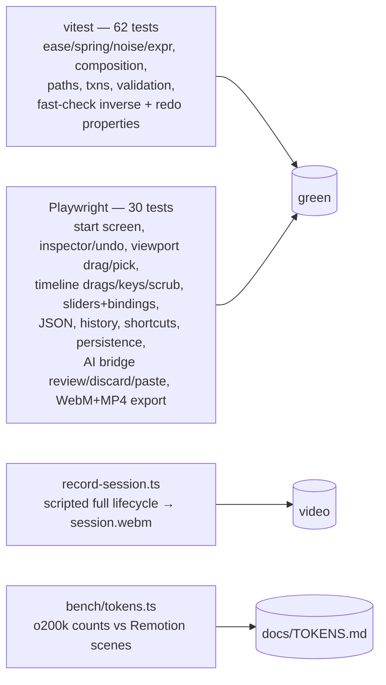
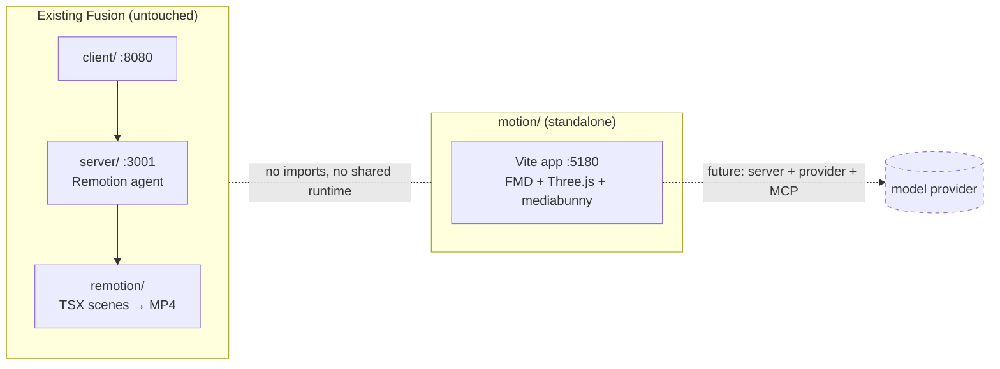

# Fusion Motion — architecture

This document explains how the pieces connect and marks what is real, what is partial, and what is a placeholder.
Legend used throughout: **Real** = implemented and covered by tests · **Partial** = works but limited ·
**Placeholder** = a stand-in so the UI behaves sensibly · **Not built** = planned, no code yet.

---

## 1. The idea in one picture

The whole video is one JSON document. Nothing else stores state. Every view reads the document, and every edit (a mouse drag, an inspector field, a slider, a pasted op, an AI turn) is expressed as **ops** that go through a single engine.



The AI box is dashed because there is **no model call inside the app yet**. The bridge is real, and any agent can drive it. In the recorded session that agent was Claude, working from outside the page.

---

## 2. Module map



Dependency rule: `fmd` and `runtime` never import React, Three or the DOM, so the same code can run in a worker, on a server, or inside an MCP server later. `render` knows Three but not React. `editor` is the only place that knows about React.

One deliberate back-edge: `ops.ts` needs to sample behaviours to `bake` them. Importing `evaluate.ts` there would create a cycle, so `evaluate.ts` registers the sampler with `ops.ts` when it loads (`registerBakeSampler`).

---

## 3. The document (FMD v0.1)

```mermaid
classDiagram
  class Doc {
    v: 1
    name
    comp: w h fps dur bg cam
    brand: font, colors{name→hex}
    assets{id→src mime w h}
    markers[]
    style: energy bounce depth speed
    bindings[]
    layers[] back→front
  }
  class Layer {
    id  (immutable)
    type
    in / out  (comp seconds)
    parent
    pos rot scale opacity depth hidden locked
    keys{channel→[[t,v,ease]]}
    beh[]
    expr{channel→string}
  }
  class Beh { id use at dur ease bounce ...params }
  class Binding { from: style.x ; path ; lo ; hi }
  Doc "1" --> "*" Layer
  Doc "1" --> "*" Binding
  Layer "1" --> "*" Beh
  Layer <|-- gradient
  Layer <|-- text
  Layer <|-- shape
  Layer <|-- image
  Layer <|-- device
  Layer <|-- cloner
  Layer <|-- camera
  Layer <|-- group
```

- **Space:** the origin is at the comp centre, Y points up, and +Z points toward the camera. Units are pixels. The default camera sits at the fit distance (z = 1713 for 1080p at 35°), so 1 unit = 1 px at z = 0.
- **Time:** `in` and `out` are comp seconds. Everything inside a layer uses layer-local time, starting at zero at `in`: behaviour `at`, key times and expression `t`. Moving a layer is therefore one `set` on `in`.
- **Colours:** either `#rrggbb` or a named brand token like `$accent`. Changing a brand colour re-themes every layer that uses it.

Full field list: `docs/FMD-SPEC.md`.

---

## 4. The edit pipeline (every change goes through this)



What makes this pipeline trustworthy:

| Property | How | Status |
|---|---|---|
| One gesture = one undo step | The UI previews through a *transient* doc and commits once, on release | **Real** |
| Exact undo/redo | Inverse primitives come from the preimage. A property test runs random op sequences 600 times and checks that undo restores the document exactly | **Real** |
| Models never do arithmetic | `set … delta`; `key` sorts and quantises; `trim` keeps the animation in place | **Real** |
| Sliders never clobber hand edits | Any direct `set` on a bound path removes that binding in the same transaction | **Real** |
| Deleting a layer leaves no dangling refs | `del` of a layer also unparents its children and clears `comp.cam` | **Real** |
| Readable errors for repair | e.g. `did you mean typeUp?`, `unknown brand color $x (have …)`, `… bake "in" or delete the keys` | **Real** |
| Collaboration (Yjs) | The op shape was designed to map onto Yjs | **Not built** |

---

## 5. How a frame is computed

`evaluate(doc, t)` is a pure function: the same document and time always give the same frame. This is why scrubbing, playback and export can never disagree.



- Springs use a closed-form damped oscillator, normalized so `ease(0)=0` and `ease(1)=1` exactly. `bounce` is a real parameter, which is what the Bounce slider binds to.
- Noise is seeded by layer id, behaviour id and index, and sampled in seconds rather than frames, so it's deterministic.
- Expressions are parsed into an AST and interpreted. There is no `eval`, and globals are unreachable (tested).

---

## 6. Rendering



- **One stage, three uses:**
  - the Viewport's shot view;
  - Split view, where the same scene is rendered again from an orbit camera with a grid, the comp frame and a `CameraHelper`;
  - the exporter, which uses its own off-screen Stage.
- **Picking:** a raycast finds the front-most mesh by render order. **Bounds:** projected Box3 → selection boxes in the viewport.
- **Performance:** the viewport renders on demand, on playhead, doc, selection, font or asset changes. The playhead never goes through React.

---

## 7. Editor state and what the screen shows



- **Transient:** holds the live result while you drag or scrub. Release commits exactly one transaction.
- **Preview:** holds an AI turn's changes until you Keep or Discard them. Making any manual edit first auto-keeps the preview, so work is never silently lost.
- **Playhead:** a plain module with subscribers and a rAF loop. Only the timecode label and the ruler canvas update each frame.

---

## 8. The AI turn (bridge)



Turn lifecycle:



Pro mode also has **Paste ops**, which runs the same review flow with no agent at all.

---

## 9. Export

```mermaid
sequenceDiagram
  participant UI as Export dialog
  participant X as exportVideo()
  participant M as mediabunny
  participant ST as off-screen Stage
  UI->>X: format, height, quality
  X->>M: getFirstEncodableVideoCodec(mp4: avc→hevc→av1→vp9 | webm: vp9→av1→vp8)
  X->>X: wait for fonts + asset textures
  X->>M: Output + CanvasSource(bitrate = w·h·fps·0.12 bpp)
  loop every frame i
    X->>ST: sync(doc, evaluate(doc, i/fps)); render()
    X->>M: source.add(t, 1/fps)
  end
  X->>M: finalize()
  M-->>UI: Blob → preview player + Download
```

Frames come from the same function as the preview, so they match exactly and none can be dropped.

- **This sandbox:** its Chromium has no H.264 encoder, so MP4 export chose AV1.
- **Normal Chrome:** picks H.264.

---

## 10. Testing and tooling



Test-only hooks exposed on `window`:
- `fusion` (the bridge);
- `__store` (read-only store access);
- `__timeline` and `__viewport` (screen geometry, so tests and agents can drive the canvases);
- `__stage`;
- `__lastExport`.

---

## 11. Real vs placeholder — the full ledger

### Real (implemented and tested)
- **FMD schema and validation:** all 8 layer types, brand tokens, assets, bindings, semantic checks.
- **Ops engine:** macros → primitives, exact inverses, one transaction per apply, binding detach, safe layer delete.
- **Evaluator:**
  - keys with per-segment easing, and 22 behaviours (own/add/text);
  - the composition rule, and expressions;
  - text units and selectors;
  - cloners (radial/grid/linear with delay/noise/wave);
  - camera fit, dolly/truck/orbit/shake;
  - bake.
- **Renderer:**
  - SDF shapes and images, per-glyph text, and a PBR device mockup with a real screen image;
  - cloners, a gradient background with grain, and 3D depth sorting;
  - picking, bounds, and split view with a camera helper.
- **Editor:**
  - viewport selection and drag-to-move with auto-key, image drop (onto a device = its screen), and the add toolbar;
  - a canvas timeline: bars, clips, keys, trim, snapping, zoom, and the camera lane;
  - the inspector: keyframe stopwatch, behaviour cards, novice presets, cloner/device/gradient/comp/brand settings, and expressions;
  - JSON edit/apply, history jump, undo/redo, keyboard shortcuts, the start screen with rendered template thumbnails, and autosave.
- **AI bridge:** pending turns with scoped context, streamed per-op review, partial accept, discard, chips with ops, paste ops.
- **Export:** MP4/WebM at 720p/1080p/4K through mediabunny. Tested at 720p for both containers; 1080p verified in the recording.

### Partial
| Area | What works | What's missing |
|---|---|---|
| Token numbers in the UI | Diff cards and the JSON tab show `≈` counts | They're estimates (`chars / 3.8`, `bridge.ts`). Real tokenizer counts exist only in `bench/tokens.ts` |
| Style **speed** | In the schema, the ops and the slider list | Nothing binds to it yet, so the slider stays hidden |
| **Markers** | In the schema; drawn on the ruler; used as snap targets | No UI to add them; no audio beat detection |
| **Group** layers | Render as transform parents | Can only be created through JSON or an agent (no toolbar button) |
| **Text selectors** (`anim`) | Evaluated and rendered (logo template) | Editable only in JSON |
| Font consistency | Bundled fonts plus a canvas-measured layout | No HarfBuzz, so line breaks may differ slightly between machines |
| Persistence | The document (localStorage) and assets (IndexedDB) | Undo history and chat aren't saved; single project only |
| Fit/performance | Smooth for the templates (~12 layers) | Not yet measured against the plan's 200-layer / 10k-instance budget; cloners are one mesh per item, not instanced |

### Placeholder (stand-ins by design)
| Placeholder | Where | Replaced by |
|---|---|---|
| **The AI itself.** No model is called in the app. Prompts wait for an agent on `window.fusion.bridge`; in the recording that was me (Claude) sending ops I wrote | `bridge.ts`, `e2e/orbit-script.ts` | An in-app provider (AI SDK `ToolLoopAgent` with `outline/inspect/apply/catalog` tools) and/or an MCP endpoint. The bridge's `pending/respond` is already the contract |
| "What the AI saw … plus a cached system prompt" | Assistant | There is no system prompt yet; it will exist when the provider does |
| Built-in demo phone/browser screen ("Ledger" UI) | `device.ts placeholderScreen` | The user's screenshot, whenever `screen` is set |
| Grey box for a missing or loading image | `stage.ts QuadView` | The real texture once it loads (export waits for all of them) |
| Dock "Select" button | `Viewport.tsx` | Always on; there is no other tool mode yet |
| `migrate()` | `persist.ts` | A no-op until v2 of the format exists |
| Start-screen project name = first clause of the prompt | `Shell.tsx` | The agent renames it (it did, to "Orbit launch") |

### Not built (planned)
- **Integrations:** the server/API (`api/` from the plan: no Hono server exists; the app is 100% client-side), the model provider, the MCP endpoint.
- **Editor features:**
  - a graph editor (value/speed curves, bezier handles), multi-select stagger and marquee;
  - audio lane and waveform, video layers, 3D meshes/glTF, particles;
  - post-FX (bloom/DOF/motion blur);
  - Lottie import/export, Figma import, AE `.jsx`, glTF export;
  - ProRes/alpha export.
- **Platform:** WebGPU, Yjs collaboration, instanced cloners.
- **Reuse from the old Fusion app:** none. The plan said to copy shadcn/ui, `AgentThoughts`, `AudioWaveform` and the gateway. To keep `motion/` light I hand-wrote the UI in plain CSS instead, and there is no server, so no gateway. `immer` is installed but unused (the store uses `structuredClone`); it can be removed.

---

## 12. How this relates to the rest of the repo



`motion/` has its own `package.json`, isn't in the root workspaces, and imports nothing from `client/`, `server/` or `remotion/`. The only shared file is `CLAUDE.md`, which has a pointer section. The token benchmark reads `remotion/src/scenes` purely to compare costs.
